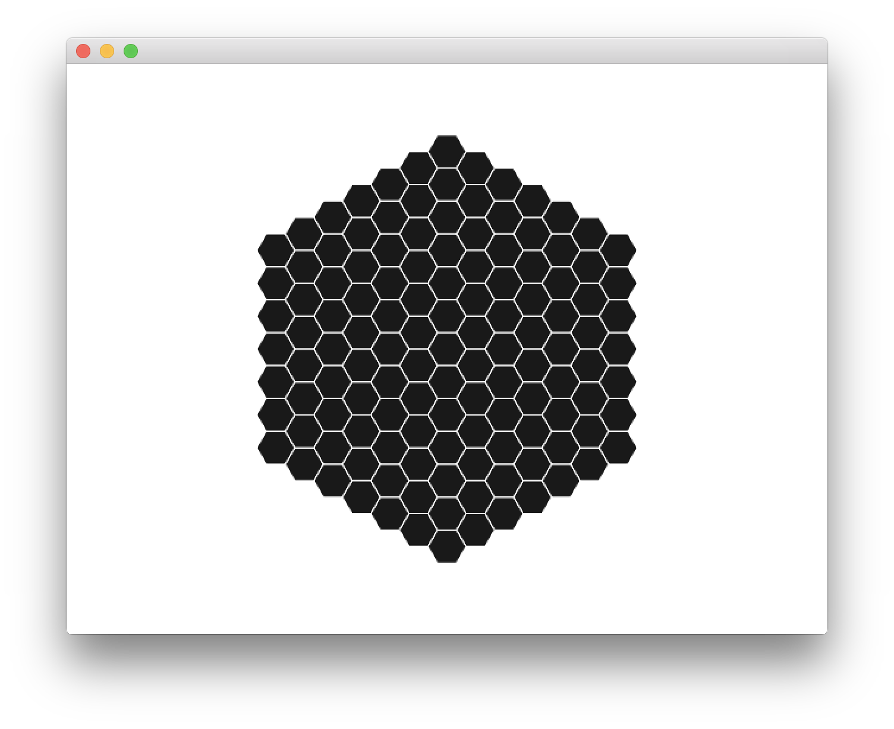
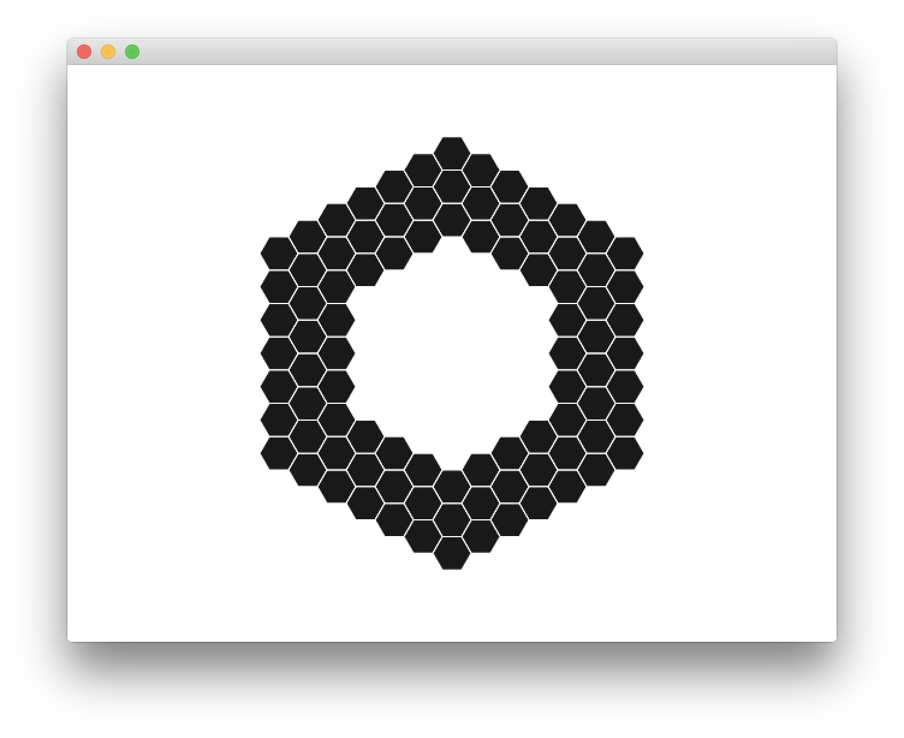
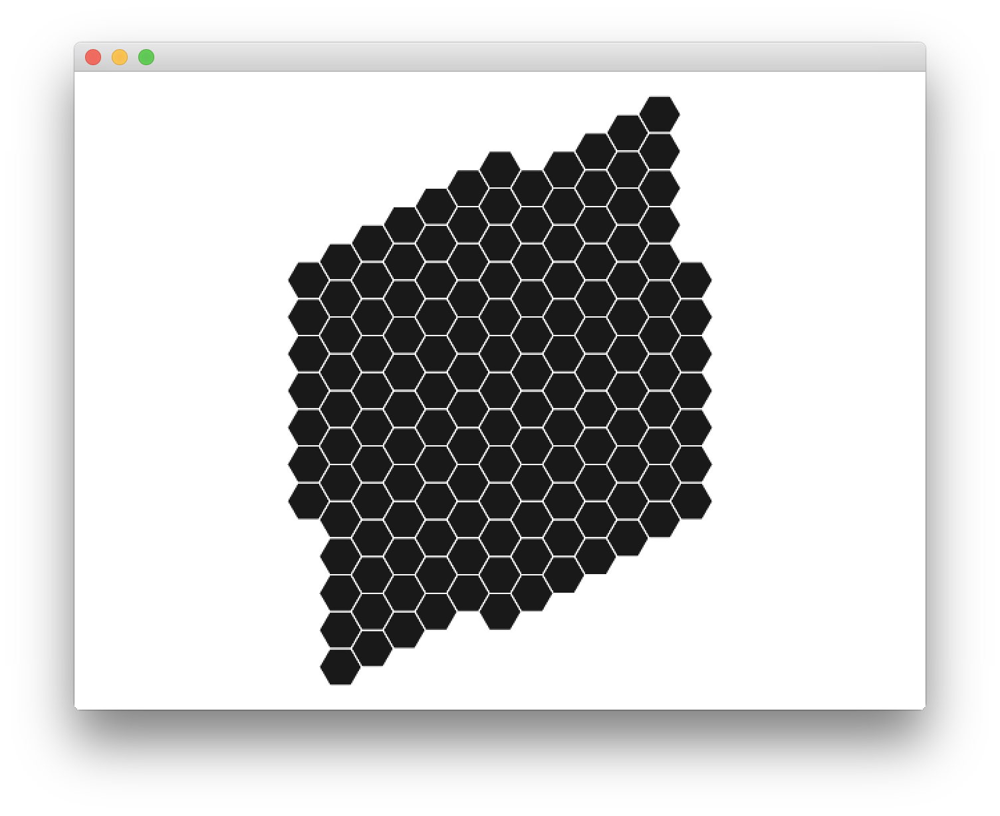
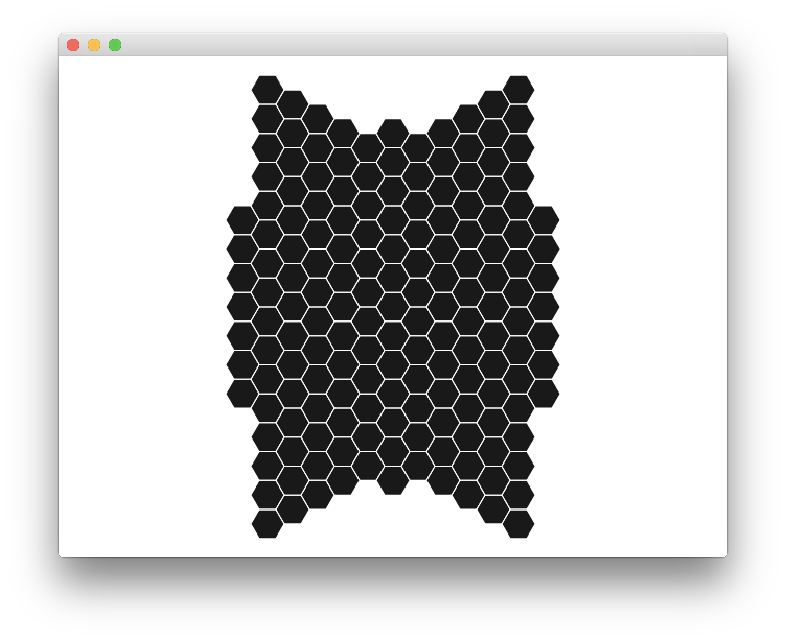
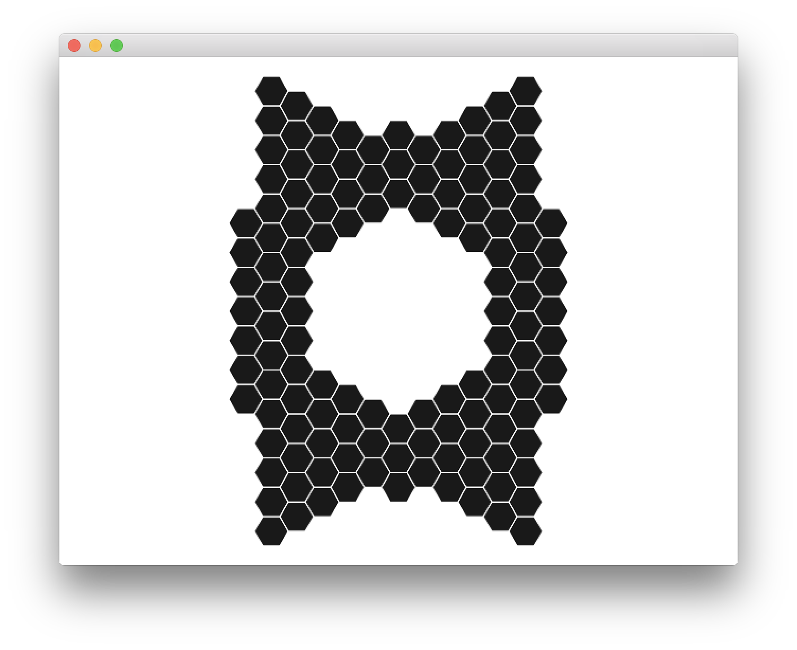
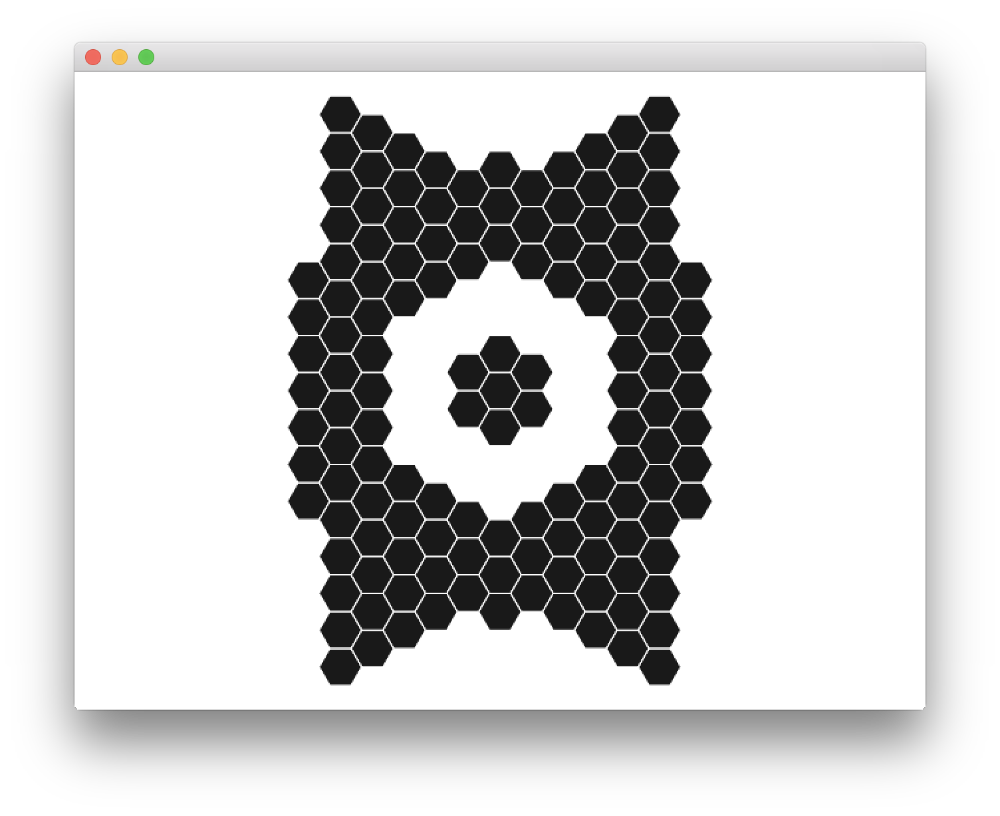
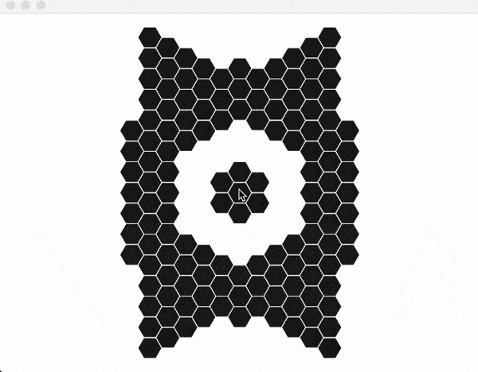

# __HEX__
## Hexagonal grids for C++
This library provides only hexagon related computations and is renderer agnostic. The examples below have been rendered using [Cinder](http://libcinder.org).

### Creation, addition & subtraction
```
l = hex::layout::hexagonal(6);
```

```
l -= hex::layout::hexagonal(3);
```

```
l += hex::layout::parallelogram(10, 10, layout::options::vertical);
```

```
l += hex::layout::parallelogram(10, 10, layout::options::standard);
```

```
l -= hex::layout::hexagonal(3);
```

```
l += hex::layout::hexagonal(1);
```


### Coordinate space conversions

```
vec2 v = vec2(e.getPos()) - getWindowCenter();
hex::point p(v.x, v.y);
hover = hex::lattice::point_to_cell(p, orientation, radius);
```


### References
Red Blob Games: http://www.redblobgames.com/grids/hexagons/
